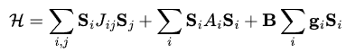

SpinW
=====

.. raw:: html

   <section class="landing-hero">
     

       
SpinW Documentation

       <h1>SpinW and pySpinW</h1>
       

         Libraries for plotting and numerically simulating magnetic structures
         and excitations from spin Hamiltonians.
       

       

         <a class="landing-button landing-button--primary" href="pyspinw/installation.html">Install pySpinW</a>
         <a class="landing-button" href="spinw/installation.html">Install SpinW</a>
         <a class="landing-button" href="https://github.com/SpinW/spinw/issues">Report Issue</a>
       

     

   </section>

.. raw:: html

   <section class="landing-section landing-section--projects">
     

       
The Projects

       <h2>One documentation home for the SpinW ecosystem</h2>
     

     

       <a class="project-card" href="spinw/overview.html">
         
         MATLAB
         <strong>SpinW</strong>
         Original SpinW implementation for MATLAB.
       </a>
       <a class="project-card" href="pyspinw/overview.html">
         
         Python
         <strong>pySpinW</strong>
         Python implementation of SpinW.
       </a>
       <a class="project-card" href="spinwcore.html">
         C++
         <strong>SpinWcore</strong>
         Core routines intended for speed-critical calculations.
       </a>
     

   </section>

Features
--------

SpinW solves spin Hamiltonians using classical and quasi-classical numerical
methods:

where :math:`S_i` are spin vector operators, :math:`J_{ij}` are exchange
matrices, :math:`A_i` are anisotropy matrices, :math:`B` is the external
magnetic field, and :math:`g_i` is the g-tensor.

.. raw:: html

   

     <section>
       <h3>Crystal Structures</h3>
       <ul>
         <li>Define arbitrary unit cells with space groups or symmetry operators.</li>
         <li>Define magnetic and non-magnetic atoms with arbitrary moment sizes.</li>
         <li>Create publication-quality crystal structure plots.</li>
       </ul>
     </section>
     <section>
       <h3>Magnetic Structures</h3>
       <ul>
         <li>Define 1D, 2D, and 3D magnetic structures.</li>
         <li>Represent incommensurate structures with rotating coordinates.</li>
         <li>Generate and plot structures on magnetic supercells.</li>
       </ul>
     </section>
     <section>
       <h3>Magnetic Interactions</h3>
       <ul>
         <li>Assign interactions to neighboring atoms by distance.</li>
         <li>Use Heisenberg, Dzyaloshinskii-Moriya, anisotropic, and tensor exchange.</li>
         <li>Calculate symmetry-allowed tensor elements from space groups.</li>
       </ul>
     </section>
     <section>
       <h3>Simulations</h3>
       <ul>
         <li>Run energy minimization, simulated annealing, and thermodynamic calculations.</li>
         <li>Simulate neutron diffraction, diffuse scattering, and spin-wave spectra.</li>
         <li>Calculate powder-averaged spectra and neutron scattering cross sections.</li>
       </ul>
     </section>
   

Our Partners
------------

.. raw:: html

   

     
     
     
     
     
   

Documentation
-------------

.. toctree::
   :maxdepth: 2
   :caption: SpinW Docs

   spinw/installation
   spinw/tutorials
   spinw/overview

.. toctree::
   :maxdepth: 2
   :caption: pySpinW Docs

   pyspinw/installation
   pyspinw/examples
   pyspinw/overview
   api/pySpinW

.. toctree::
   :maxdepth: 2
   :caption: Resources

   resources/faq
   resources/publications
   resources/presentations
   resources/contact
   spinwcore
